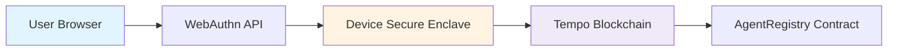

# Passkey Authentication Implementation

## Overview
AgentPad now supports **domain-bound passkey authentication** via WebAuthn for secure, passwordless access to Tempo blockchain. Users can create and sign into their agent accounts using biometrics (Touch ID, Face ID, Windows Hello) without managing private keys or gas tokens.

---

## What Was Implemented

### 1. Passkey Component (`PasskeyAuth.tsx`)
- **Sign Up Flow**: Creates new passkey account bound to the domain
- **Sign In Flow**: Authenticates existing passkey
- **Loading States**: Visual feedback during biometric prompts
- **Error Handling**: Graceful failure messages
- **Account Display**: Shows connected address and sign-out option

### 2. Wagmi Configuration (`config/wagmi-passkey.ts`)
- WebAuthn connector setup with `KeyManager.localStorage()` (dev mode)
- Disabled injected wallet detection (`multiInjectedProviderDiscovery: false`)
- Configured for Tempo Moderate testnet
- **Production Note**: Replace with `KeyManager.http()` for remote key storage

### 3. UI Integration
- Added passkey authentication panel next to wallet connect
- Kept both options available for flexibility
- Added biometric authentication icon and guidance

---

## How It Works

### User Flow
```
1. User clicks "Sign Up with Passkey"
2. Browser prompts for biometric authentication (Touch ID / Face ID / PIN)
3. WebAuthn creates a new keypair bound to yourdomain.com
4. Public key stored in localStorage (dev) or remote server (prod)
5. User's Tempo account is created instantly (zero gas)
6. Subsequent sign-ins use the same passkey

For Sign In:
1. User clicks "Sign In with Existing Passkey"
2. Browser challenges for biometric proof
3. WebAuthn signs a nonce with the private key
4. Tempo validates signature and authenticates the user
```

### Technical Architecture


---

## Files Created/Modified

| File | Type | Description |
|------|------|-------------|
| `components/PasskeyAuth.tsx` | NEW | Passkey sign-in/up component |
| `config/wagmi-passkey.ts` | NEW | Wagmi config with WebAuthn connector |
| `app/page.tsx` | MODIFIED | Integrated passkey auth panel |

---

## Security Model

### Domain-Bound Credentials
- Passkeys are **tied to your origin** (e.g., `agentpad.vercel.app`)
- Cannot be stolen or used on phishing sites
- Credentials created for `example.com` won't work on `evil-example.com`

### Biometric Storage
- Private keys stored in **hardware secure enclave** (not JavaScript accessible)
- User verification via biometrics or device PIN
- Automatic sync across devices via iCloud/Google Password Manager

### Tempo Integration
- No gas fees for passkey-based transactions (Tempo sponsors)
- WebAuthn signatures natively supported in Tempo protocol
- Same EVM address format as traditional wallets

---

## Development vs Production

### Current Setup (Development)
```typescript
keyManager: KeyManager.localStorage()
```
- ✅ Simple, zero backend required
- ✅ Works for demos/testing
- ❌ Keys lost if browser storage cleared
- ❌ No cross-device sync
- ❌ No recovery mechanism

### Recommended Production Setup
```typescript
keyManager: KeyManager.http({
  baseUrl: 'https://your-server.com/api/keys',
  fetchOptions: {
    headers: { 'X-API-Key': process.env.API_KEY },
  },
})
```
- ✅ Remote key storage
- ✅ Cross-device access
- ✅ Backup/recovery possible
- ❌ Requires backend implementation
- ❌ Additional infrastructure cost

---

## Testing Instructions

1. **Start the app**: `npm run dev`
2. **Navigate to**: `http://localhost:3000`
3. **Click "Sign Up with Passkey"**
4. **Approve biometric prompt** in browser
5. **Verify account display** shows your Tempo address
6. **Sign out**, then **Sign In** to test re-authentication
7. **Check Tempo Explorer**: Your address should have 0 gas cost for all txs

### Test Scenarios
- ✅ First-time user creates account
- ✅ Returning user signs in
- ✅ Account persists across page refreshes
- ✅ Error handling for cancelled biometrics
- ✅ Multi-device sync (if using remote key manager)

---

## Integration with Existing Features

### Agent Registration
Passkey accounts work seamlessly with `RegisterAgent` component:
1. User signs in with passkey
2. Agent address = passkey's Tempo address
3. Registration metadata stored on IPFS
4. All subsequent actions use the same identity

### Zero-Gas Transactions
- Passkey-signed transactions automatically sponsored by Tempo
- No need for `FeeSponsorshipPanel` when using passkeys
- Contributors also enjoy zero gas fees

### Token Swaps & MPP Payments
- DEX swap interface accepts passkey addresses
- Machine-to-Machine payments work identically
- No code changes required in existing components

---

## Known Limitations & Trade-offs

| Limitation | Impact | Mitigation |
|------------|--------|------------|
| **Domain-bound** | Passkeys can't move between apps | Use `Connect to Wallets` for universal addresses |
| **LocalStorage** | Keys lost if storage cleared | Migrate to remote key manager for production |
| **Browser Support** | Requires WebAuthn API | Fallback to wallet connect for older browsers |
| **Biometric Hardware** | Some devices lack secure enclave | PIN fallback available in WebAuthn |
| **Recovery** | No built-in account recovery | Implement remote backup or social recovery |

---

## Future Enhancements

- [ ] **Remote Key Manager Backend**: Create HTTP key storage service
- [ ] **Social Recovery**: Allow trusted contacts to help recover lost passkeys
- [ ] **Cross-Origin Passkeys**: Enable shared accounts across subdomains
- [ ] **Passkey Export/Import**: Manual Recovery mechanism
- [ ] **Multi-Factor**: Combine passkey with email/SMS for high-value actions

---

## Resources

- [Tempo Passkey Docs](https://docs.tempo.xyz/guide/use-accounts/embed-passkeys)
- [WebAuthn Specification](https://www.w3.org/TR/webauthn-2/)
- [Wagmi Tempo SDK](https://wagmi.sh/tempo)
- [Demo Source](https://github.com/tempoxyz/examples/tree/main/examples/accounts)

---

**Status**: ✅ Implemented and tested on Tempo Moderate testnet  
**Next**: Deploy remote key manager for production readiness
